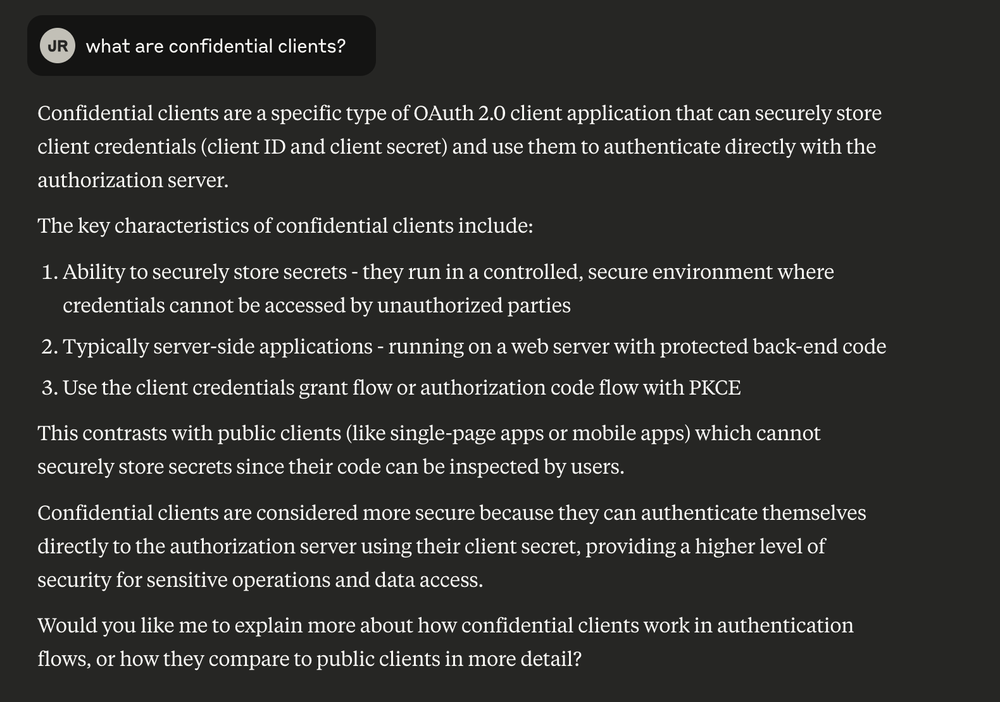
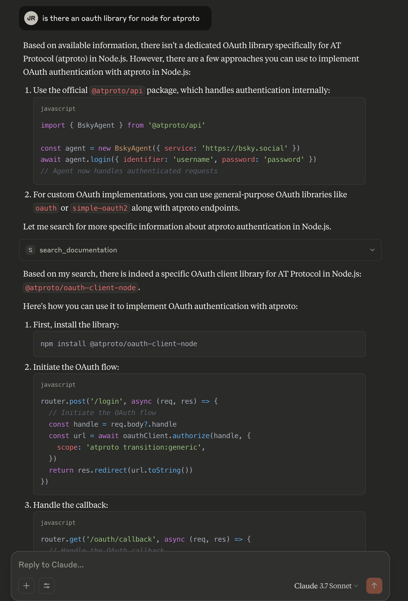

# MCPs for Documentation Experiment

*Goal: Play with all the new toys (I mean protocols)!*

Last weekend I read Cloudflare’s post [“Thirteen new MCP servers from Cloudflare you can use today”](https://blog.cloudflare.com/thirteen-new-mcp-servers-from-cloudflare/), and I really wanted to try playing with them. 

Inspired by Cloudflare’s own [Cloudflare Documentation server](https://github.com/cloudflare/mcp-server-cloudflare/tree/main/apps/docs-vectorize) I decided to see how long it would take me to make an _**ATproto Documentation server**_. 

## Have I mentioned that I’m currently obsessed with @protocol?

After recently embarking on a journey into oAuth on the ATprotocol I’ve gotten deeply familiar with one section of their docs, the oAuth section. 

Because oAuth is hard, and myself and others have struggled when trying to implement it, I wanted to make a tool to make our lives easier.

>💡 What if there was an MCP server that was designed specifically to help you build on the protocol? 

## MCP Server Deployments on Cloudflare

I started with the MCP server template available at: [https://github.com/cloudflare/ai/tree/main/demos/remote-mcp-authless](https://github.com/cloudflare/ai/tree/main/demos/remote-mcp-authless)

I chose the authless version because I want the final product to be openly available, and I don’t need to even look at anything related to auth this week. 

## Search tools on MCP 🔍

I started by getting the MCP server running locally and then connecting to it with this MCP Inspector for local dev found here: [https://github.com/modelcontextprotocol/inspector](https://github.com/modelcontextprotocol/inspector)

Once I could connect to it, from both MCP Inspector and my locally running Claude app, I started modifying the tools, and replaced the `add` and `calculate` operations with my own called `search`. 

I added a `src/tools/docs.ts` and copied from Cloudflare’s Documentation MCP server’s search tool which I found at: [https://github.com/cloudflare/mcp-server-cloudflare/](https://github.com/cloudflare/mcp-server-cloudflare/) 

At this point it threw the kinds of errors I expected, it would try to search, but now I needed to feed it some documentation for reference. 

## 📚📖 Connecting to source data 

By looking at what CloudFlare’s MCP connected to, I knew I needed a vector index, but I quickly learned what I’m actually doing is “RAG” Retrieval Augmented Generation, and Cloudflare has another fun new tool called AutoRAG, which is only in beta. 

Instead of making my own Vectorize index, I let AutoRAG do that for me. 

I followed Cloudflare’s *Rags to Riches* tutorial. [https://blog.cloudflare.com/introducing-autorag-on-cloudflare/#rag-to-riches-in-under-5-minutes](https://blog.cloudflare.com/introducing-autorag-on-cloudflare/#rag-to-riches-in-under-5-minutes)

RAGs need a source of data, like a bucket (because AutoRAG’s ability to scrape the web directly isn’t available yet). 

Also, I wanted to make this worker ingest all the documentation at once and then keep that up to date on a cron schedule, instead of feeding it html page by page as per the tutorial. 

By also referencing this tutorial, [Build a RAG from your website · AutoRAG](https://developers.cloudflare.com/autorag/tutorial/brower-rendering-autorag-tutorial/), I pieced together a worker that uses puppeteer to scrape ATproto’s documentation site. 

## Storage thoughts

Once I got that up and scraping, I didn’t worry too much about the storage format. Reddit suggested not to use structured data like `blob` (which is what I would have gone with, had I not looked it up). 

The tutorial only kept the content text returned by puppeteer, so initially that’s what I kept. Probably these files should be converted to markdown for better indexing, but for now they are just raw html. At first I also timestamped every file, which in hindsight, I decided to change since there’s no need to keep backdated versions of the documentation in my use case. 

Now I had all the components, and just needed one last step to stitch them together… 

### To recap, so far I’d created:

1. An authless MCP server that adds a “search” tool to agents like Claude (but not yet connected to any data)
2. An AutoRAG vector index =&gt; pointed to an R2 bucket as its source
3. An R2 bucket with some HTML content from [https://atproto.com/](https://atproto.com/)
4. A Cloudflare worker that auto-updates the HTML content from the documentation site.

At this point I went back to my authless MCP server and connected it to the AutoRAG. 

## ✅ Connecting the dots

This was more difficult than expected, but after some debugging `search` was working, or at least attempting to search, but my index still showed no data. 

After patiently waiting a while, my scanned documents went from “Queued” to “Indexed” and then my queries started working. 

I still had some formatting to do, but it was there. 

I asked Claude _“what is the atmosphere”_ and got back this…

`The Atmosphere refers to an open, decentralized network for building social applications, as stated in the [AT Protocol documentation](https://atproto.com/_1746644339578.html) and [https://atproto.com/_1746644337860.html](https://atproto.com/_1746644337860.html). It is described as \"The AT Protocol is an open, decentralized network for building social applications\" in the provided documents.",`

☁️🎉☁️🎉☁️🎉☁️🎉☁️🎉☁️🎉☁️🎉☁️🎉☁️🎉☁️🎉☁️🎉☁️🎉☁️🎉☁️🎉☁️🎉☁️🎉

## Scraping More Resources

On the initial scrape pass I only retrieved the first page of [atproto.com](https://atproto.com/), and ended up with two copies from accidentally triggering the cron run twice as I was trying to make it run manually.

*Side note - Cloudflare does not make it as easy as it should be to manually trigger cron jobs.* 😡 

While cleaning up the file names, I modified the worker to do a simple recursive pass on any in-page links. This works to scrape the entire [atproto.com](http://atproto.com) docs site, but I’m barely scratching the surface of the resources that are out there that could be fed into this tool. 

## Next steps

I would love to continue building out the resources. Including things like the git repos and maybe even some blogs by prominent contributors. 

I'm hoping that the community will want to help expand this, while respecting everyone’s contributions. 

#### Keeping the lights on*

\* A quick note about costs… I used Cloudflare services that are either in free-beta today or have a free tier limit. I’m only going to be able to personally support the MCP server while this is all still free. If this blows up, I will be more than happy to turn it over to the community to support. 

>Today I just want to make this version 0 immediately available to the world. 

### Ready to ask the atproto doc’s questions directly?

Full instructions are on the README at [mcp-atproto-docs](https://github.com/immber/mcp-atproto-docs)

## Screenshots of examples

